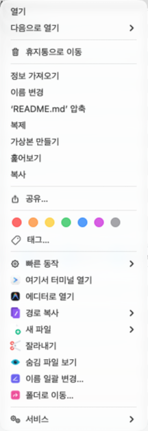
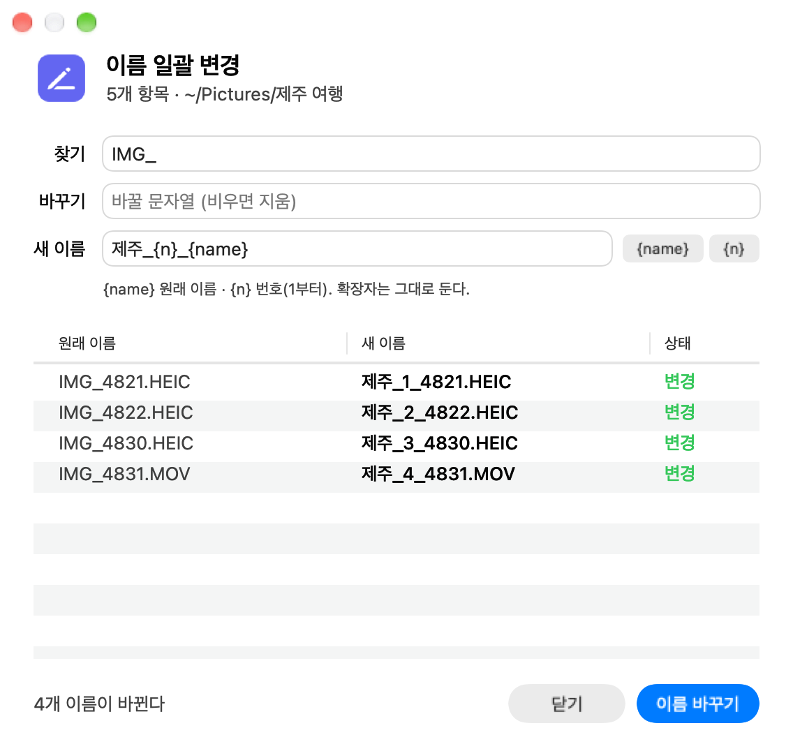

<div align="center">


# Righto

**Windows처럼 쓰는 macOS Finder 우클릭 메뉴**

터미널 열기 · 에디터로 열기 · 경로 복사 · 새 파일 · 잘라내기/붙여넣기 · 숨김 파일 보기/가리기 · 이름 일괄 변경 · 폴더로 이동


[](https://github.com/siyul-jh/righto/actions/workflows/dmg.yml)

</div>

---

## 기능

| | 기능 | 설명 |
|---|---|---|
|  | **여기서 터미널 열기** | 선택한 폴더(파일이면 그 위치)를 설정한 터미널로 연다. 메뉴에 앱 아이콘이 표시된다 |
|  | **에디터로 열기** | 선택한 파일·폴더를 설정한 에디터로 연다. 메뉴에 앱 아이콘이 표시된다 |
|  | **경로 복사** | 전체 경로 / 이름만 / 상대 경로 |
|  | **새 파일** | `.txt` `.md` `.json` `.html` `.py` `.sh` (json·html·sh는 기본 내용 포함) |
|  | **잘라내기** | 선택 항목을 잘라낸다 |
|  | **여기에 붙여넣기 (이동)** | 잘라낸 항목이 있을 때만 나타난다. 이름이 겹치면 번호를 붙인다 |
|  | **숨김 파일 보기 / 가리기** | `Cmd+Shift+.` 와 같은 효과를 메뉴에서 실행한다. 현재 상태에 따라 라벨이 바뀐다. 키보드로 직접 전환하면 라벨이 반대로 보일 수 있고, 메뉴로 한 번 전환하면 다시 맞는다 |
|  | **이름 일괄 변경…** | 현재 폴더의 항목(숨김 파일 제외)을 대상으로 한다. 찾기를 입력하면 이름에 그 문자열이 든 항목만 골라 바꾸고 번호도 그 항목끼리 매긴다. 찾기/바꾸기와 새 이름 템플릿(`{name}` 원래 이름, `{n}` 번호)을 쓰고, 확장자는 그대로 둔다. 미리보기에서 중복·기존 파일과의 충돌을 보여 주고 충돌이 있으면 적용하지 않는다 |
|  | **폴더로 이동…** | 클립보드에 있는 경로를 미리 채운다. `~`, 셸 이스케이프 경로, 현재 폴더 기준 상대 경로를 받는다. 메뉴를 연 Finder 창에서 바로 이동하고, 파일 경로면 그 파일을 선택해 보여 준다 |
|  | **새 버전 받기** | 새 릴리스가 있을 때만 메뉴 맨 아래에 나타난다 |

폴더 배경, 폴더, 파일 우클릭과 Finder 도구 막대 버튼에서 같은 메뉴를 쓸 수 있다.

## 화면

### 우클릭 메뉴

Finder 기본 항목 아래에 Righto 항목이 붙는다. 터미널·에디터 항목에는 설정에서 고른 앱의 아이콘이 표시된다.

<p align="center">
<picture>
  <source media="(prefers-color-scheme: dark)" srcset="screenshots/menu-dark.png">
  
</picture>
</p>

### 이름 일괄 변경

현재 폴더의 항목 중 찾기에 입력한 문자열이 이름에 든 것만 표에 나오고 바뀐다. 찾기를 비우면 폴더의 모든 항목이 대상이다. 찾기/바꾸기와 새 이름 템플릿을 입력하면 표에서 바로 결과를 미리 볼 수 있다. 아래 예시는 `IMG_`를 지우고 `제주_{n}_{name}` 템플릿으로 번호를 붙인 모습이다. 폴더의 5개 항목 중 `IMG_`가 들지 않은 `메모.txt`는 대상에서 빠진다. 이미 있는 파일과 겹치거나 새 이름끼리 중복되면 상태 열에 빨갛게 표시되고 **이름 바꾸기** 버튼이 꺼진다.

<p align="center">
<picture>
  <source media="(prefers-color-scheme: dark)" srcset="screenshots/rename-dark.png">
  
</picture>
</p>

### 폴더로 이동

클립보드에 경로가 있으면 입력 칸에 미리 채워 준다. 입력하는 동안 칸 아래에 그 경로가 폴더인지, 파일인지, 없는 경로인지 보여 주고, 없는 경로면 **이동** 버튼이 꺼진다. **이동**을 누르면 새 창을 열지 않고 메뉴를 연 Finder 창의 경로를 바꾼다. 바탕화면에서 열었거나 Finder 제어 권한이 없으면 새 창으로 연다.

<p align="center">
<picture>
  <source media="(prefers-color-scheme: dark)" srcset="screenshots/goto-dark.png">
  
</picture>
</p>

## 설치

### 방법 1. DMG (권장)

[Releases](https://github.com/siyul-jh/righto/releases)에서 최신 `Righto-<버전>.dmg`를 받는다.

1. DMG를 열고 **Righto.app**을 **Applications**로 끌어다 놓는다.
2. `Righto.app`을 한 번 실행한다. 설정 창이 열리면 터미널·에디터를 고르고 **적용**을 누른다.
   **적용**은 Finder 확장을 켜고 Finder를 재시작하므로, 누르면 바로 우클릭 메뉴에 나타난다.
3. 그래도 메뉴가 나오지 않으면 **시스템 설정 > 개인정보 보호 및 보안 > 확장 프로그램 > Finder**에서 `Righto`를 켠다.

> **다른 Mac에서 받은 DMG:** Apple 개발자 인증(공증)이 없는 ad-hoc 서명이라 "확인되지 않은 개발자" 경고가 뜬다. 소스를 확인한 뒤 격리 속성을 제거하고 실행한다.
> ```sh
> xattr -dr com.apple.quarantine /Applications/Righto.app
> ```
>
> **업데이트 후 권한:** DMG 는 ad-hoc 서명이라 새 버전을 설치하면 macOS 가 다른 앱으로 보고 손쉬운 사용·Finder 제어 권한을 다시 묻는다. 손쉬운 사용 목록에 예전 `Righto` 항목이 남아 있으면 `−` 로 지우고 다시 켠다.
>
> **소스 빌드 버전이 이미 있다면:** `~/Applications/Righto.app`을 지우고 설치해야 확장이 중복 등록되지 않는다.

### 방법 2. 소스 빌드

Xcode(`swiftc`)만 있으면 된다. 외부 의존성은 없다.

```sh
git clone https://github.com/siyul-jh/righto
cd righto
./build.sh
```

`build.sh`는 `~/Applications/Righto.app`을 빌드하고 Finder 확장을 등록한 뒤 Finder를 재시작한다. 처음 실행할 때 로그인 키체인에 자체 서명 인증서 `Righto Local`을 만들어 서명하므로, 다시 빌드해도 허용한 권한이 유지된다.

메뉴가 나오지 않으면 **시스템 설정 > 개인정보 보호 및 보안 > 확장 프로그램 > Finder**에서 `Righto`를 켠다.

### 권한

설정 창을 열면 없는 권한을 macOS 에 요청한다. 뜨는 창에서 허용하면 기능을 쓸 때 다시 묻지 않는다.

| 권한 | 쓰는 기능 | 거부하면 |
|---|---|---|
| 데스크탑·문서·다운로드 폴더 | 이름 일괄 변경 | 그 폴더에서 처음 쓸 때 다시 묻는다 |
| Finder 제어(자동화) | 폴더로 이동 | 새 Finder 창으로 연다 |
| 손쉬운 사용 | 숨김 파일 보기/가리기 | Finder 를 재시작해서 전환한다(화면이 잠깐 깜박임) |

손쉬운 사용은 **시스템 설정 열기**를 누른 뒤 `Righto`를 직접 켠다. 거부한 권한은 macOS 가 다시 묻지 않으므로 **시스템 설정 > 개인정보 보호 및 보안**에서 켠다. 손쉬운 사용 화면을 찾기 어려우면 터미널에서 바로 연다.

```sh
open "x-apple.systempreferences:com.apple.preference.security?Privacy_Accessibility"
```

## 설정

`Righto.app`을 실행하면 설정 창이 열린다. 터미널과 에디터를 고르고 **적용**을 누른다. 적용하기 전까지는 저장되지 않고, **닫기**를 누르면 변경이 버려진다. **적용**은 항상 누를 수 있고, 누르면 설정을 저장한 뒤 Finder 확장을 켜고 Finder를 재시작해 우클릭 메뉴에 바로 반영한다.

<p align="center">
<picture>
  <source media="(prefers-color-scheme: dark)" srcset="screenshots/settings-dark.png">
  
</picture>
</p>

팝업에는 설치된 앱만 아이콘과 함께 나온다.

| | 목록에 나오는 앱 |
|---|---|
| **터미널** | cmux, Ghostty, iTerm, Warp, Terminal 중 설치된 것 |
| **에디터** | Antigravity, Cursor, VS Code, Zed, Sublime Text, BBEdit, Nova, CotEditor, Xcode, TextEdit 중 설치된 것 |

- 목록에 없는 앱은 **기타…**로 직접 고른다.
- 한 번도 고르지 않았거나 고른 앱이 지워졌으면 설치된 목록의 첫 번째 앱을 쓴다.
- 설정은 `~/Library/Application Support/Righto/config.json`에 저장된다.
- kitty, Alacritty처럼 폴더를 명령줄 인자로만 받는 터미널은 폴더가 열리지 않을 수 있다.

## 업데이트 확인

메뉴를 열 때 하루에 한 번 GitHub API(`api.github.com/repos/siyul-jh/righto/releases/latest`)로 최신 버전만 확인한다. Righto가 쓰는 네트워크 요청은 이것뿐이며, 파일 정보는 보내지 않는다.

## iCloud Drive

iCloud Drive 폴더에서는 우클릭 메뉴가 나타나지 않는다. macOS가 iCloud Drive를 자체 Finder 확장으로 관리해서 다른 앱의 Finder 확장이 같은 폴더에 메뉴를 붙일 수 없기 때문이다(Sonoma 이후). 대신 **Finder 도구 막대의 Righto 버튼**을 사용한다.

도구 막대에 넣으려면 Finder 도구 막대를 우클릭하고 **도구 막대 사용자화…**에서 `Righto`를 끌어다 놓는다.

## 라이선스

[MIT](LICENSE)
